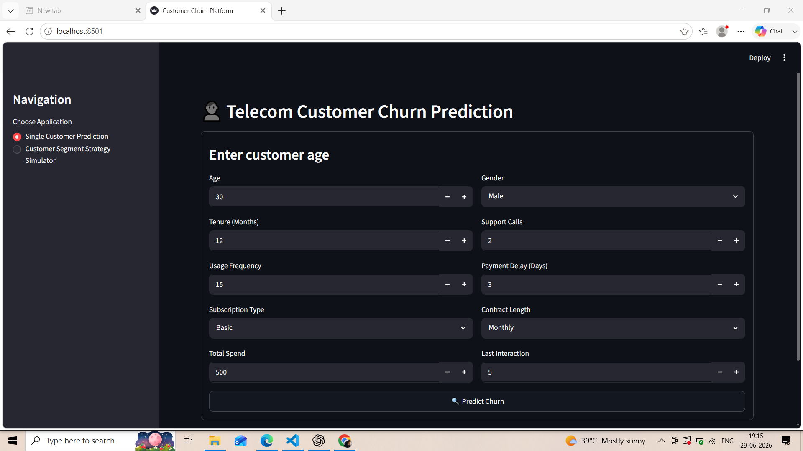
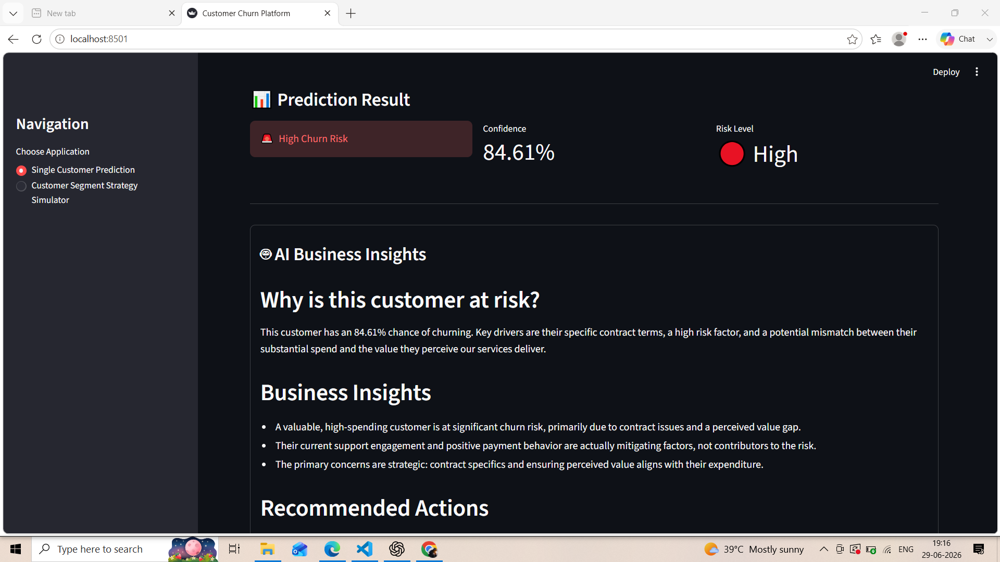
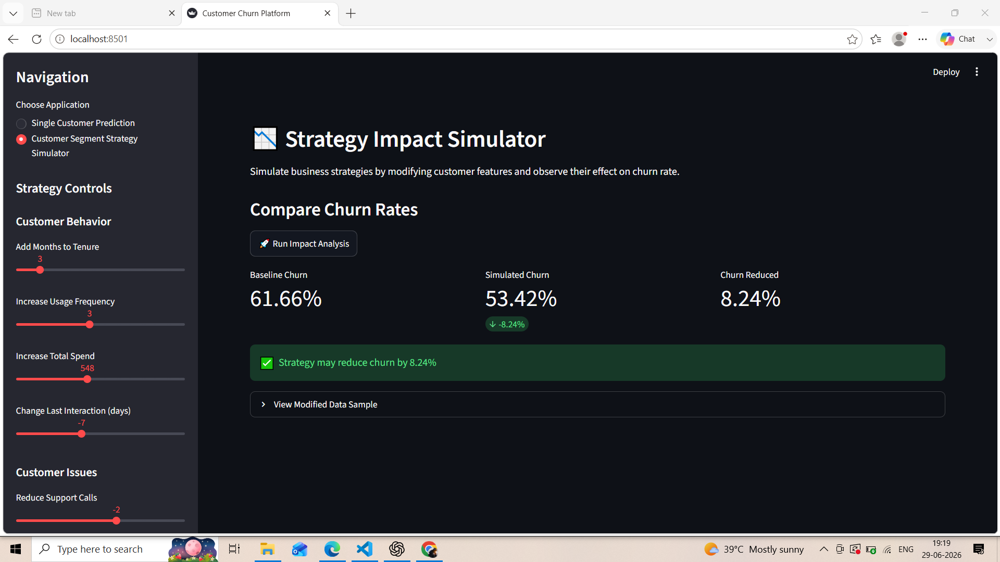

# 📊 Telecom Customer Churn Prediction Platform

An end-to-end Machine Learning application that predicts telecom customer churn and provides AI-powered business explanations using **Google Gemini** and **SHAP Explainability**.

The application also includes a **Customer Strategy Simulator** that allows businesses to evaluate how different retention strategies may impact overall churn.

---


## ✨ Features

### 👤 Single Customer Churn Prediction
- Predict whether a customer is likely to churn.
- Displays prediction confidence.
- Business-friendly AI explanation powered by Google Gemini.
- Technical SHAP explanation available in an expandable section.

### 🤖 AI Business Insights
- Converts complex SHAP feature contributions into simple stakeholder-friendly insights.
- Explains why the customer is likely to churn.
- Provides actionable retention recommendations.

### 📉 Customer Strategy Simulator
- Simulate different business strategies.
- Modify customer behavior and subscription plans.
- Compare baseline churn vs simulated churn.
- Measure estimated churn reduction.

---

## 🛠️ Tech Stack

### Machine Learning
- Scikit-learn
- LightGBM Classifier
- SHAP

### LLM
- Google Gemini API

### Backend
- Python

### Frontend
- Streamlit

### Data Processing
- Pandas
- NumPy

### Model Persistence
- Joblib

---

## 📂 Project Structure

```text
Telecom-Customer-Churn-Prediction/
│
├── images/
│   ├── home.png
│   ├── BusinessInsights.png
│   └── Simulator.png
│
├── src/
│   ├── predictor.py         # Prediction logic
│   ├── shap_explainer.py    # SHAP explanation
│   ├── llm_explainer.py     # Gemini business explanation
│   ├── simulator.py         # Strategy simulator
│   └── __init__.py
│
├── app.py                   # Streamlit application
├── model.pkl                # Trained ML model
├── clean_df.csv             # Processed dataset
├── CustomerChurn.ipynb      # Model training notebook
├── requirements.txt
├── .env.example             # Environment variables template
└── README.md
```

---

## ⚙️ Installation

### Clone the repository

```bash
git clone https://github.com/rajjaiswal159/Telecom-Customer-Churn-Prediction.git

cd Telecom-Customer-Churn-Prediction
```

### Create virtual environment

```bash
python -m venv venv
```

### Activate virtual environment

Windows

```bash
venv\Scripts\activate
```

Mac/Linux

```bash
source venv/bin/activate
```

### Install dependencies

```bash
pip install -r requirements.txt
```

---

## 🔑 Environment Variables

Create a `.env` file.

```text
GEMINI_API_KEY=your_api_key_here
```

---

## ▶️ Run the Application

```bash
streamlit run app.py
```

---

## 📸 Application Preview

### Home Page



---

### AI Business Insights



---

### Strategy Simulator



---

## 💡 Workflow

```text
Customer Input
       │
       ▼
Data Preprocessing
       │
       ▼
Machine Learning Model
       │
       ▼
Prediction
       │
       ▼
SHAP Explainability
       │
       ▼
Top Feature Contributions
       │
       ▼
Google Gemini
       │
       ▼
Business-Friendly Explanation
```

---

## 🎯 Business Value

This application bridges the gap between Machine Learning predictions and business decision-making by:

- Predicting customer churn accurately.
- Explaining predictions in simple business language.
- Helping stakeholders understand churn drivers.
- Supporting proactive customer retention strategies.
- Simulating business interventions before implementation.

---

## 👨‍💻 Author

**Raj Jaiswal**

---